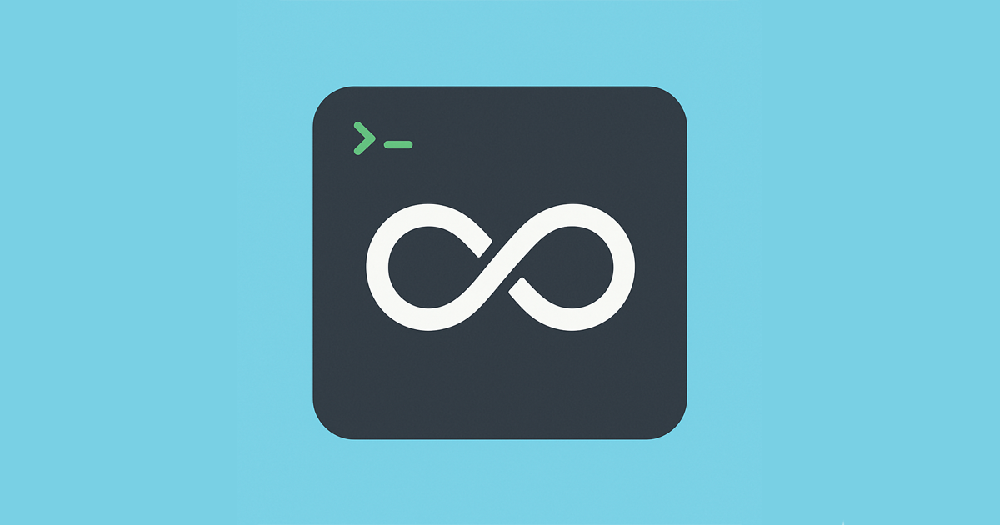
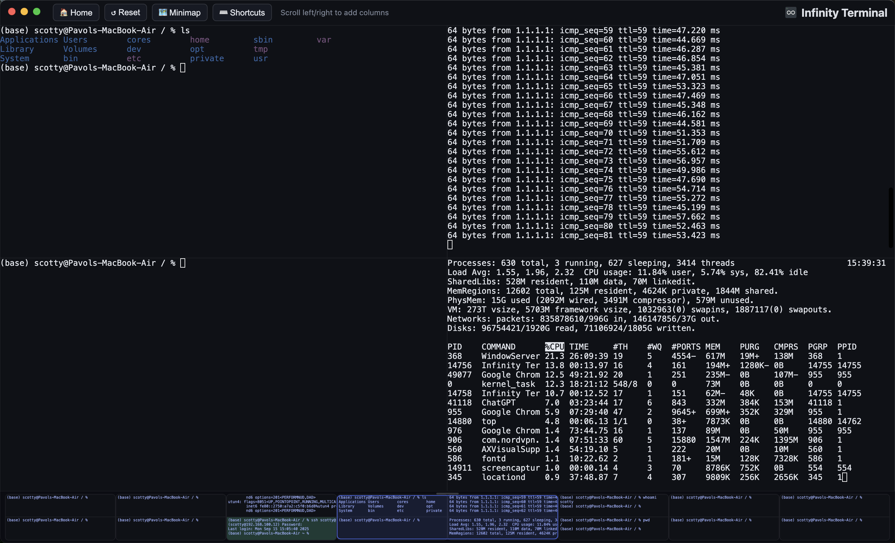
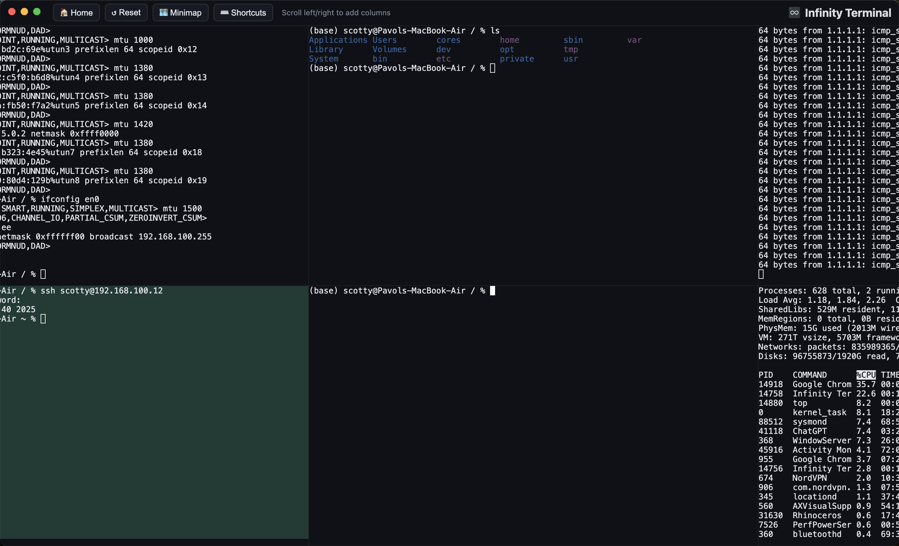

# Infinity Terminal — Two Rows. Endless Columns.

## Screenshots

## Overview
- Fullscreen Electron app showing a grid of terminals: always 2 rows, unlimited columns.
- Scroll horizontally with a trackpad (two-finger swipe) to navigate columns.
- Each column holds two terminals (top and bottom). Start with 2 columns (4 terminals).
 - Optional horizontal minimap: drag to pan; toggle with a button or shortcut.

Prerequisites
- macOS or Linux (Ubuntu 20.04+ recommended).
- Node.js 18+ and npm.

Install
1. cd into this folder
2. npm install
3. npm run rebuild:pty   # rebuild node-pty for your Electron
4. npm start

Usage
- App launches fullscreen; toolbar at top:
  - 🏠 Home: scroll to the original two columns (keeps all terminals). Shortcut: Cmd+Shift+H (mac) or Ctrl+Shift+H (win/linux).
  - ⬅️/➡️ Add Column: keyboard shortcuts to add columns without clicking:
    - Add Left: Cmd+Shift+Left (mac) or Ctrl+Shift+Left (win/linux)
    - Add Right: Cmd+Shift+Right (mac) or Ctrl+Shift+Right (win/linux)
  - ↺ Reset: recreate the original two columns (disposes current terminals and PTYs).
  - ＋ New Column: adds another pair of terminals.
- Scroll horizontally (two-finger swipe) to move across columns.
- Each pane resizes automatically; scrollback defaults to 5,000 lines.

Minimap
- Toggle: toolbar “🗺 Minimap” or Cmd/Ctrl + Shift + M.
- Drag anywhere on the minimap to pan the main grid.
- Resize vertically: drag the top edge handle; layout adapts live.
- The minimap mirrors the 2×N grid (two stacked thumbnails per column).
- Pane backgrounds in the minimap match the terminals’ backgrounds.

SSH-Aware Background Colors
- Local shells keep the default background (Color A).
- After a successful SSH login (strict success cues like “Last login”), the
  terminal background changes to a deterministic dark color based on host/IP.
- All terminals connected to the same host share the same color.
- On SSH disconnect/failure, the pane reverts to the default background.
- The minimap reflects these background colors.

Recover After Exit
- When a PTY exits, the pane shows a short message.
- Press Enter or click the pane to immediately respawn a local shell in place.

Notes
- The app uses @xterm/xterm for terminal rendering and node-pty for pseudo-terminal processes.
- Fit is implemented without @xterm/addon-fit to avoid peer/version issues.
 - The grid’s scrollbar is styled dark to match the theme.

Project Structure
- electron/main.js: Electron app, PTY management, IPC.
- electron/preload.js: secure bridge exposing PTY APIs to the renderer.
- src/index.html, src/styles.css: UI and layout.
- src/renderer.js: xterm.js setup, 2xN grid logic.
 - resources/appLogoSmaller.icns: macOS app icon for packaged builds.
 - resources/appLogoWithBackground_1200x630px.png: main logo with background.
 - resources/screenshot.png, resources/screenshot2.png: app screenshots.

Customization
- Change default number of initial columns in `src/renderer.js`.
- Adjust theme/fonts in `src/renderer.js` and `src/styles.css`.
 - Tweak SSH success/failure/close detection patterns in `src/renderer.js`.

Troubleshooting
- If terminals are blank, ensure node modules installed: `npm install`.
- If Electron shows a native module mismatch for node-pty, run `npm run rebuild:pty` (it auto-detects your installed Electron version), then `npm start` again.

Build a macOS App (DMG/ZIP)
- Install builder (already in devDependencies): `npm i`.
- Build: `npm run dist` → creates signed, notarized `.app`, `.dmg`, and `.zip` in `dist/`.
- Icons: uses `resources/appLogoSmaller.icns`.
- **Code Signing & Notarization**: Fully implemented with Developer ID certificate.
- **Security**: Apps install without warnings on macOS thanks to proper signing and notarization.
- **Default Directory**: Terminal opens in user's home directory (like native Terminal.app).
- `.gitignore` excludes `dist/` and signing secrets, so artifacts and credentials aren't committed.

Build a Linux App (AppImage/DEB)
- Build: `npm run dist:linux` → creates `.AppImage` and `.deb` in `dist/`.
- Optional: `npm run dist:appimage` or `npm run dist:deb`.
- If `node-pty` fails to load in the packaged app, ensure `asarUnpack` includes `**/*.node` and `node_modules/node-pty/**` (already configured).
