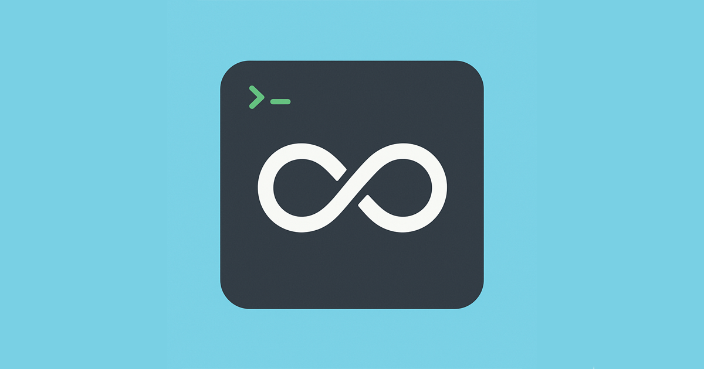
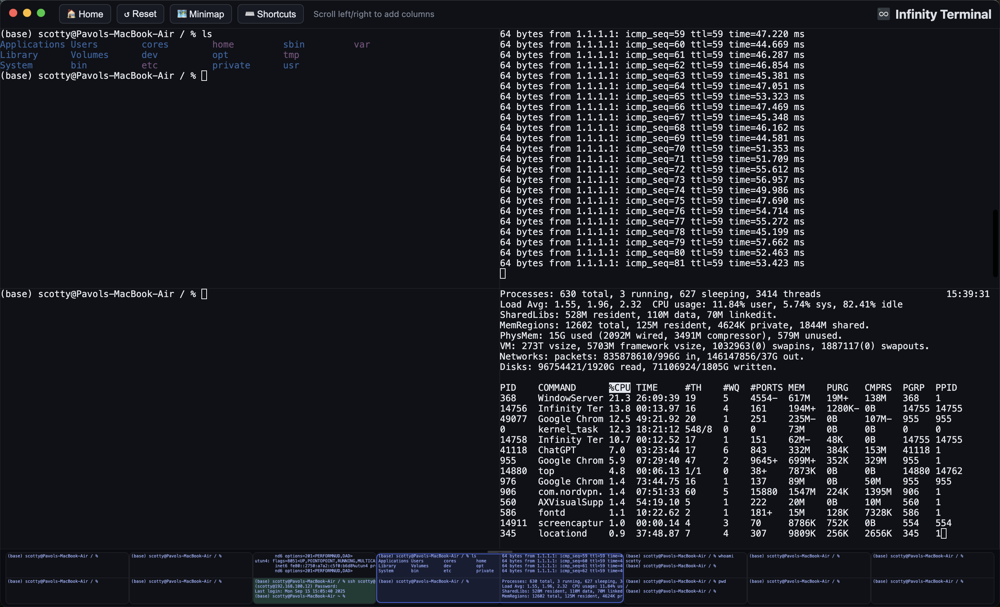
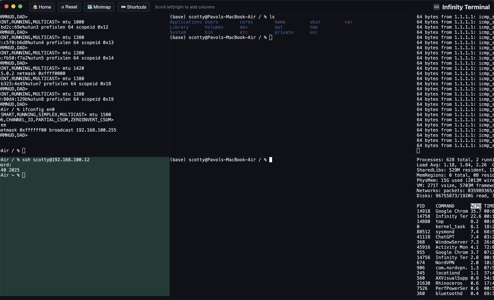

# Infinity Terminal — Two Rows. Endless Columns.

A native macOS terminal app: a horizontally scrolling grid of terminals,
always two rows tall and as many columns wide as you want. Built with
Swift / AppKit and [SwiftTerm](https://github.com/migueldeicaza/SwiftTerm).

## Screenshots




## Requirements

- macOS 14 (Sonoma) or later
- Xcode 15+ command line tools (`xcode-select --install`)
- A Developer ID Application certificate is only needed for signed/notarized
  builds; debug builds run unsigned.

## Build & run

```sh
swift build -c release
open .build/release/InfinityTerminal      # or run from Xcode
```

For a fully packaged, signed, and notarized DMG:

```sh
# put APPLE_ID, APPLE_PASSWORD (app-specific), APPLE_TEAM in .env
./build-app.sh --dmg
```

`build-app.sh` produces `.build/InfinityTerminal.app` (always) and
`.build/InfinityTerminal-<version>.dmg` (with `--dmg`). Notarization is
skipped if the Apple credentials aren't present.

## Project layout

- `Sources/InfinityTerminal/` — Swift sources
  - `main.swift` — `NSApplication` bootstrap
  - `Models/` — grid + session model objects
  - `Views/` — AppKit views (toolbar, columns, panes, minimap, shortcuts)
  - `Resources/` — bundled icon + logo
- `Package.swift` — SwiftPM manifest (target depends on SwiftTerm)
- `build-app.sh` — packaging / signing / notarization
- `resources/` — README screenshots and the OG image used by the website

## Releases

Tagged `v1.x.y`; the GitHub release is built and published manually from
`build-app.sh` output. The `update-web.yml` workflow propagates the release
notes onto [infinityterminal.com](https://infinityterminal.com).
