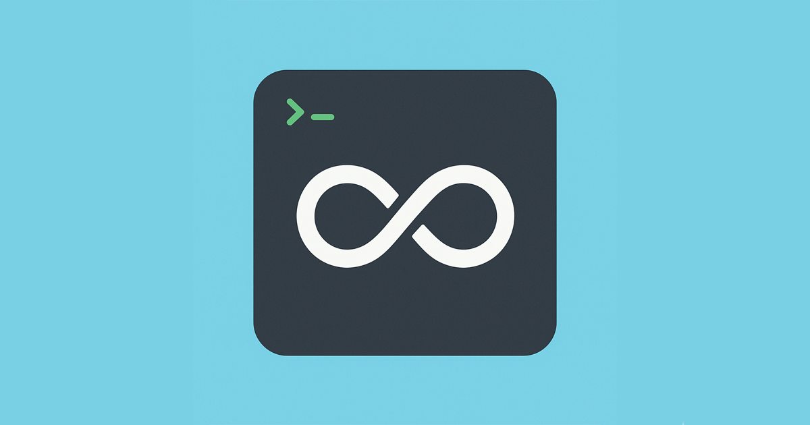
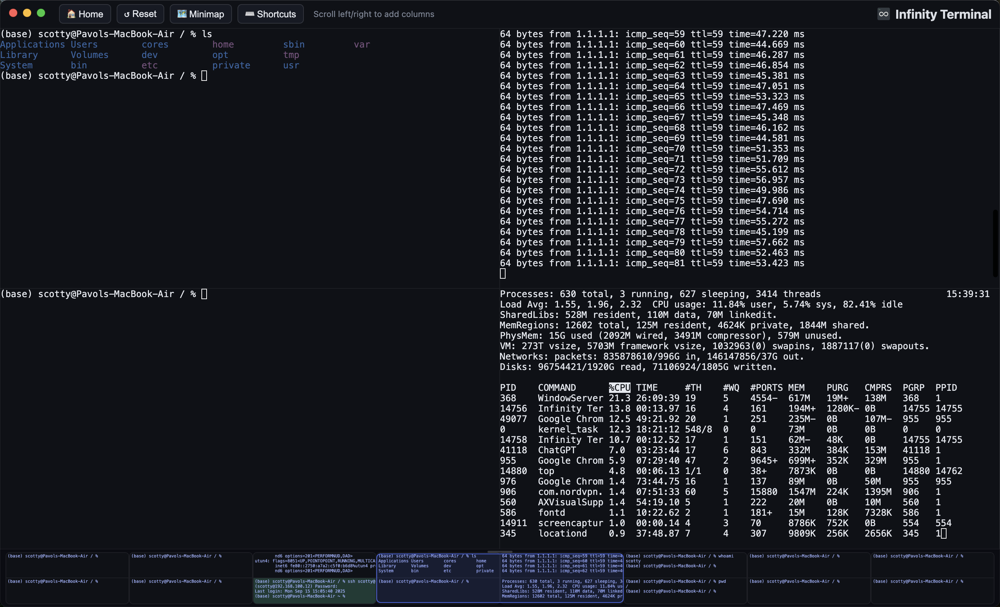
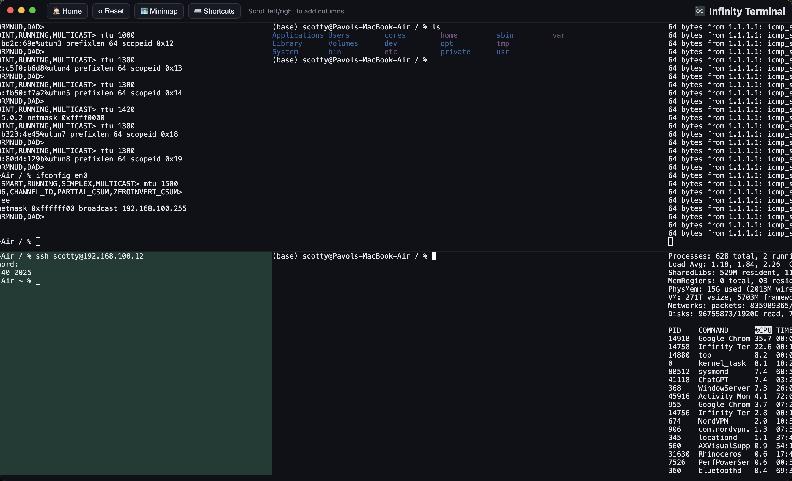

# Infinity Terminal — Two Rows. Endless Columns.

A native macOS terminal app: a horizontally scrolling grid of terminals,
always two rows tall and as many columns wide as you want. Built with
Swift / AppKit and [SwiftTerm](https://github.com/migueldeicaza/SwiftTerm).

## Screenshots




## Keyboard shortcuts

Press <kbd>⌘</kbd><kbd>/</kbd> in the app for the same list.

### Moving around

| Shortcut | Action |
| --- | --- |
| <kbd>⌃</kbd><kbd>⇥</kbd> | Focus the next column (wraps at the end) |
| <kbd>⌃</kbd><kbd>⇧</kbd><kbd>⇥</kbd> | Focus the previous column (wraps at the start) |
| <kbd>⌥</kbd><kbd>⌘</kbd><kbd>←</kbd> / <kbd>→</kbd> | Step one column; hold to smooth-scroll |
| <kbd>⌥</kbd><kbd>⌘</kbd><kbd>↑</kbd> / <kbd>↓</kbd> | Focus the pane above / below |
| <kbd>⌘</kbd><kbd>⇧</kbd><kbd>H</kbd> | Home — back to the first two columns |

Keyboard navigation moves keyboard focus with it, so what you type lands in the
pane you just navigated to. Scrolling with the trackpad or dragging the minimap
deliberately leaves focus alone, so peeking at another column never pulls the
cursor out of a running command.

### Layout

| Shortcut | Action |
| --- | --- |
| <kbd>⌘</kbd><kbd>⇧</kbd><kbd>←</kbd> / <kbd>→</kbd> | Add a column to the left / right |
| <kbd>⌘</kbd><kbd>⇧</kbd><kbd>R</kbd> | Reset to the original two columns |
| <kbd>⌘</kbd><kbd>⇧</kbd><kbd>M</kbd> | Toggle the minimap |
| <kbd>⌘</kbd><kbd>/</kbd> | Show the shortcuts panel (<kbd>Esc</kbd> closes it) |

### Text & appearance

| Shortcut | Action |
| --- | --- |
| <kbd>⌘</kbd><kbd>C</kbd> / <kbd>⌘</kbd><kbd>V</kbd> | Copy / paste in the focused pane |
| <kbd>⌥</kbd><kbd>←</kbd> / <kbd>→</kbd> | Move the cursor by word |
| <kbd>⌥</kbd><kbd>⌫</kbd> | Delete the previous word |
| <kbd>⌘</kbd><kbd>=</kbd> / <kbd>⌘</kbd><kbd>-</kbd> / <kbd>⌘</kbd><kbd>0</kbd> | Font size up / down / reset |
| <kbd>⌘</kbd><kbd>⌥</kbd><kbd>O</kbd> | Toggle Option as Meta (off = <kbd>⌥</kbd><kbd>3</kbd> types #) |

## Requirements

- macOS 14 (Sonoma) or later
- Xcode 15+ command line tools (`xcode-select --install`)
- A Developer ID Application certificate is only needed for signed/notarized
  builds; debug builds run unsigned.

## Build & run

```sh
swift build -c release
open .build/release/InfinityTerminal      # or run from Xcode
```

For a fully packaged, signed, and notarized DMG:

```sh
# put APPLE_ID, APPLE_PASSWORD (app-specific), APPLE_TEAM in .env
./build-app.sh --dmg
```

`build-app.sh` produces `.build/InfinityTerminal.app` (always) and
`.build/InfinityTerminal-<version>.dmg` (with `--dmg`). Notarization is
skipped if the Apple credentials aren't present.

## Project layout

- `Sources/InfinityTerminal/` — Swift sources
  - `main.swift` — `NSApplication` bootstrap
  - `Models/` — grid + session model objects
  - `Views/` — AppKit views (toolbar, columns, panes, minimap, shortcuts)
  - `Resources/` — bundled icon + logo
- `Package.swift` — SwiftPM manifest (target depends on SwiftTerm)
- `build-app.sh` — packaging / signing / notarization
- `resources/` — README screenshots and the OG image used by the website

## Releases

Tagged `v1.x.y`; the GitHub release is built and published manually from
`build-app.sh` output. The `update-web.yml` workflow propagates the release
notes onto [infinityterminal.com](https://infinityterminal.com).
